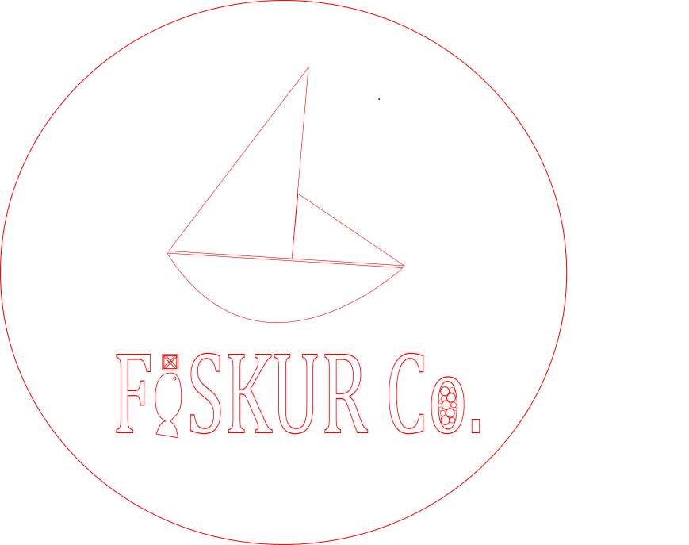
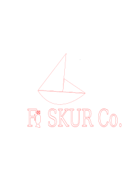

# Verkefni 2.1

### 11/3/2022
Í dag áttum við að búa til logo á Inkscape.
Ég bjó til logo sem ég kallaði FISKUR Co. sem er með "simplistic" mynd af bát með fisk í staðin fyrir I á logoinnu. Líka bætti ég við rimlakassa á fisknum svo að fiskin leit út eins og lítið i.

Líka í Co. ég bætti við smá kavíar í o'inu af Co. fyrir smá "extra detailes"
## Logo.png

## Logo.svg

